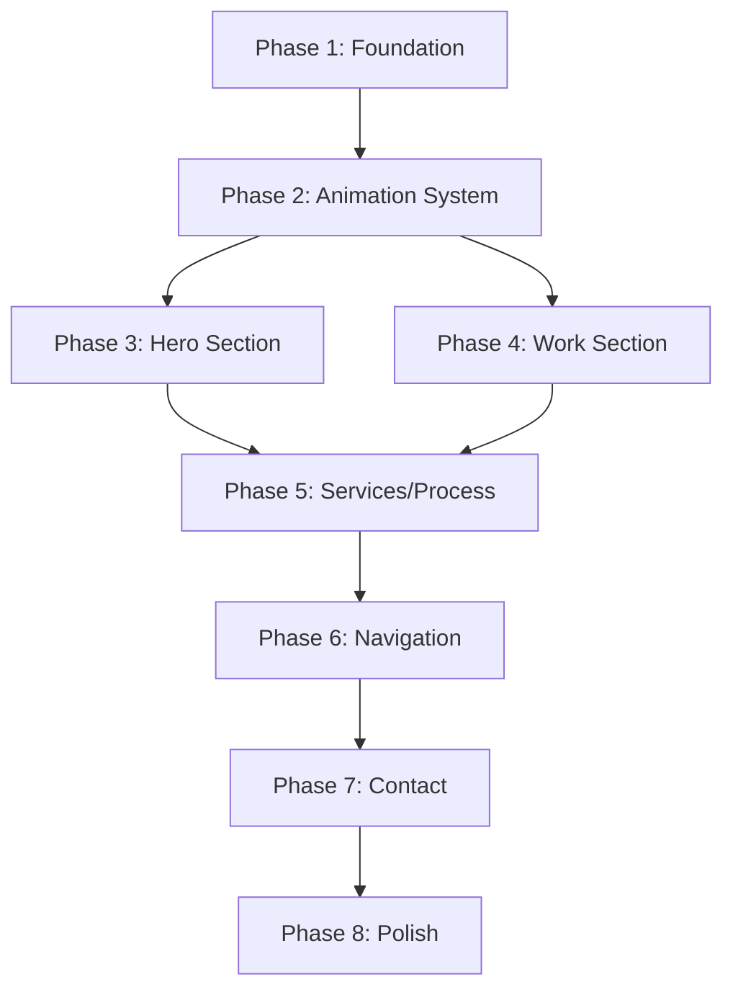

# Enterprise Redesign: Flashy Credibility Site for mikeyoung.ai

**Plan Created:** January 2026
**Detail Level:** A LOT (Comprehensive)
**Inspiration Source:** data-center-advocacy
**Target:** Enterprise-grade personal credibility site

---

## Overview

Complete redesign of mikeyoung.ai from the ground up, transforming it from a minimalist business card site into a premium, flashy enterprise-grade credibility site. The redesign will borrow proven patterns from data-center-advocacy (spring animations, glass morphism, sophisticated color tokens) while adding cutting-edge 2026 design elements (kinetic typography, mesh gradients, scroll-based interactions).

**Goals:**
- Create immediate visual impact that impresses enterprise buyers
- Establish credibility within 50 milliseconds (first impression threshold)
- Showcase technical sophistication through the site itself
- Maintain performance despite enhanced visuals

---

## Problem Statement / Motivation

The current mikeyoung.ai site is intentionally minimalist—typography-forward with restrained animations. While professional, it doesn't communicate:
- The technical depth and innovation capability expected of an AI consultant
- Visual sophistication that enterprise buyers associate with premium services
- The "wow factor" that differentiates from competitors

Enterprise buyers form trust judgments in milliseconds. A more visually impressive site will:
- Signal technical competence through implementation quality
- Create memorable first impressions that lead to callbacks
- Demonstrate the same attention to detail clients will receive in engagements

---

## Proposed Solution

### Design Direction

**Theme:** "Premium Technical Sophistication"

| Element | Current | New Direction |
|---------|---------|---------------|
| Animation | CSS-only, subtle | Framer Motion with spring physics, scroll-linked |
| Color | Light mode, muted | Deep navy + electric blue gradients, glassmorphism |
| Typography | Restrained | Kinetic headlines, gradient text, bolder hierarchy |
| Interactions | Hover states only | Parallax, scroll reveals, micro-interactions |
| Hero | Simple fade-in | Full-screen with particles/mesh gradient, staggered entrance |
| Cards | Basic shadow hover | Glass morphism, scale transforms, animated borders |

### Technology Additions

| Package | Purpose | Impact |
|---------|---------|--------|
| `framer-motion` | Spring physics, scroll animations | Core animation upgrade |
| `@tsparticles/react` | Particle backgrounds (optional) | Hero visual impact |

---

## Technical Approach

### Phase 1: Foundation (Design System Upgrade)

**Deliverables:**
- New color token system with enterprise palette
- Enhanced shadow hierarchy (3 levels)
- Glass morphism utility classes
- Gradient presets (mesh, linear, text)
- Spring animation constants

**Files to Modify:**
- `tailwind.config.ts` - Complete color/shadow/animation overhaul
- `src/app/globals.css` - Glass morphism, gradient utilities, grain texture
- `src/types/animations.ts` - Framer Motion type definitions

**Success Criteria:**
- [ ] All new colors follow WCAG AA contrast
- [ ] Glass effects work across browsers (webkit prefix)
- [ ] Reduced motion respected in all new animations

#### `tailwind.config.ts` Changes

```typescript
// NEW: Enterprise color palette (from data-center-advocacy)
colors: {
  // Deep navy foundation
  ink: '#0B1220',
  'ink-muted': '#4A5568',
  'ink-subtle': '#6B7280',

  // Enterprise blue spectrum
  primary: {
    DEFAULT: '#1E3A8A',  // Deep blue - CTAs
    hover: '#1E40AF',
    light: '#EFF6FF',    // Backgrounds
    dark: '#1E3A5F',
  },

  // Accent - for key highlights only
  accent: {
    DEFAULT: '#3B82F6',  // Electric blue
    glow: 'rgba(59, 130, 246, 0.4)',
  },

  // Glass morphism tokens
  glass: {
    bg: 'rgba(255, 255, 255, 0.85)',
    'bg-scrolled': 'rgba(255, 255, 255, 0.95)',
    border: 'rgba(255, 255, 255, 0.2)',
  },
},

// NEW: Shadow hierarchy
boxShadow: {
  'card': '0 1px 3px rgb(0 0 0 / 0.04), 0 4px 6px rgb(0 0 0 / 0.02)',
  'card-hover': '0 4px 12px rgb(0 0 0 / 0.06), 0 8px 16px rgb(0 0 0 / 0.04)',
  'elevated': '0 8px 24px rgb(0 0 0 / 0.08), 0 16px 32px rgb(0 0 0 / 0.04)',
  'glow': '0 0 30px rgba(59, 130, 246, 0.3)',
},
```

#### `globals.css` Additions

```css
/* Glass morphism utility */
.glass {
  background: var(--glass-bg);
  backdrop-filter: blur(12px);
  -webkit-backdrop-filter: blur(12px);
  border: 1px solid var(--glass-border);
}

/* Mesh gradient background */
.mesh-gradient {
  background:
    radial-gradient(at 40% 20%, rgba(59, 130, 246, 0.15) 0px, transparent 50%),
    radial-gradient(at 80% 80%, rgba(30, 58, 138, 0.1) 0px, transparent 50%),
    radial-gradient(at 0% 50%, rgba(125, 211, 252, 0.08) 0px, transparent 50%);
}

/* Gradient text */
.gradient-text {
  background: linear-gradient(135deg, #1E3A8A 0%, #3B82F6 50%, #7DD3FC 100%);
  -webkit-background-clip: text;
  -webkit-text-fill-color: transparent;
  background-clip: text;
}

/* Animated gradient border */
@property --angle {
  syntax: '<angle>';
  initial-value: 0deg;
  inherits: false;
}

.gradient-border {
  --angle: 0deg;
  border: 2px solid transparent;
  background:
    linear-gradient(white, white) padding-box,
    linear-gradient(var(--angle), #3B82F6, #1E3A8A, #7DD3FC) border-box;
  animation: rotate-gradient 3s linear infinite;
}

@keyframes rotate-gradient {
  to { --angle: 360deg; }
}
```

---

### Phase 2: Animation System

**Deliverables:**
- Framer Motion integration
- Reusable animation components
- Scroll-linked animation hooks
- Spring physics constants

**Files to Create:**
- `src/lib/motion.ts` - Animation variants and spring configs
- `src/components/ui/motion-fade.tsx` - FadeIn component (from data-center-advocacy)
- `src/components/ui/motion-stagger.tsx` - Staggered container
- `src/hooks/use-scroll-progress.ts` - Scroll position hook

**Success Criteria:**
- [ ] Spring animations feel organic and premium
- [ ] Scroll animations trigger at correct viewport positions
- [ ] No animation jank on mobile devices
- [ ] Reduced motion completely disables all motion

#### `src/lib/motion.ts`

```typescript
import { Variants, Transition } from 'framer-motion';

// Consistent spring physics (from data-center-advocacy)
export const SPRING: Transition = {
  type: 'spring',
  stiffness: 300,
  damping: 25,
};

export const SPRING_SNAPPY: Transition = {
  type: 'spring',
  stiffness: 400,
  damping: 30,
};

// Reusable variants
export const fadeInUp: Variants = {
  hidden: { opacity: 0, y: 20 },
  visible: {
    opacity: 1,
    y: 0,
    transition: SPRING,
  },
};

export const scaleIn: Variants = {
  hidden: { opacity: 0, scale: 0.95 },
  visible: {
    opacity: 1,
    scale: 1,
    transition: SPRING,
  },
};

export const staggerContainer: Variants = {
  hidden: { opacity: 0 },
  visible: {
    opacity: 1,
    transition: {
      staggerChildren: 0.15,
      delayChildren: 0.1,
    },
  },
};

// Hover effects
export const cardHover = {
  scale: 1.03,
  y: -4,
  transition: SPRING_SNAPPY,
};

export const cardTap = {
  scale: 0.98,
};
```

#### `src/components/ui/motion-fade.tsx`

```tsx
'use client';

import { motion, useReducedMotion } from 'framer-motion';
import { ReactNode } from 'react';
import { SPRING } from '@/lib/motion';

interface FadeInProps {
  children: ReactNode;
  className?: string;
  delay?: number;
  direction?: 'up' | 'down' | 'left' | 'right';
}

export function FadeIn({
  children,
  className,
  delay = 0,
  direction = 'up'
}: FadeInProps) {
  const shouldReduceMotion = useReducedMotion();

  const directionOffset = {
    up: { y: 20 },
    down: { y: -20 },
    left: { x: 20 },
    right: { x: -20 },
  };

  if (shouldReduceMotion) {
    return <div className={className}>{children}</div>;
  }

  return (
    <motion.div
      initial={{ opacity: 0, ...directionOffset[direction] }}
      whileInView={{ opacity: 1, x: 0, y: 0 }}
      viewport={{ once: true, margin: '-80px' }}
      transition={{ ...SPRING, delay }}
      className={className}
    >
      {children}
    </motion.div>
  );
}
```

---

### Phase 3: Hero Section Redesign

**Deliverables:**
- Full-screen hero with mesh gradient background
- Kinetic headline animation (word-by-word reveal)
- Trust metrics bar with counting animation
- Glass morphism CTA cards
- Optional: Particle background

**Files to Modify:**
- `src/components/sections/hero.tsx` - Complete rewrite

**Visual Design:**

```
┌─────────────────────────────────────────────────────────────────┐
│ [Mesh Gradient Background + Grain Texture]                       │
│                                                                   │
│              ┌─────────────────────────────────┐                 │
│              │   [Animated Word Reveal]         │                 │
│              │   AI-First Solutions             │                 │
│              │   for Enterprise Growth          │                 │
│              │                                  │                 │
│              │   [Subheadline - fade in]        │                 │
│              │   Helping companies leverage...  │                 │
│              │                                  │                 │
│              │   ┌─────────┐  ┌───────────┐    │                 │
│              │   │ Book a  │  │ View Work │    │                 │
│              │   │ Call    │  │ (ghost)   │    │                 │
│              │   └─────────┘  └───────────┘    │                 │
│              └─────────────────────────────────┘                 │
│                                                                   │
│  ┌─────────────────────────────────────────────────────────────┐ │
│  │ [Glass Card - Trust Bar]                                     │ │
│  │   12+ Years Experience  |  $2.1B Value Created  |  50+ ...   │ │
│  └─────────────────────────────────────────────────────────────┘ │
│                                                                   │
│                          [Scroll Indicator ↓]                     │
└─────────────────────────────────────────────────────────────────┘
```

**Success Criteria:**
- [ ] Hero loads in under 2 seconds
- [ ] Headline animation completes in 800ms
- [ ] Metrics animate from 0 to value over 1.5s
- [ ] Mobile layout stacks gracefully
- [ ] Scroll indicator pulses to draw attention

#### `hero.tsx` Structure

```tsx
<section className="relative min-h-screen flex items-center justify-center overflow-hidden">
  {/* Background Layers */}
  <div className="absolute inset-0 mesh-gradient" />
  <div className="absolute inset-0 grain-overlay opacity-[0.03]" />

  {/* Content */}
  <motion.div
    variants={staggerContainer}
    initial="hidden"
    animate="visible"
    className="relative z-10 text-center"
  >
    {/* Animated Headline */}
    <motion.h1 variants={fadeInUp} className="text-6xl lg:text-7xl font-bold">
      <span className="gradient-text">AI-First Solutions</span>
      <br />
      for Enterprise Growth
    </motion.h1>

    {/* Subheadline */}
    <motion.p variants={fadeInUp} className="mt-6 text-xl text-ink-muted">
      {content.hero.subtitle}
    </motion.p>

    {/* CTAs */}
    <motion.div variants={fadeInUp} className="mt-8 flex gap-4 justify-center">
      <Button variant="primary" size="lg">Book a Call</Button>
      <Button variant="ghost" size="lg">View Work</Button>
    </motion.div>
  </motion.div>

  {/* Trust Bar */}
  <motion.div
    initial={{ opacity: 0, y: 40 }}
    animate={{ opacity: 1, y: 0 }}
    transition={{ delay: 0.6, ...SPRING }}
    className="absolute bottom-12 left-1/2 -translate-x-1/2 glass rounded-2xl px-8 py-6"
  >
    <TrustMetrics />
  </motion.div>

  {/* Scroll Indicator */}
  <ScrollIndicator />
</section>
```

---

### Phase 4: Work/Portfolio Section

**Deliverables:**
- Glass morphism project cards with hover scale
- Image reveal animation (blur to clear)
- Staggered grid entrance
- Project detail modal with spring animation

**Files to Modify:**
- `src/components/sections/work.tsx` - Enhanced cards
- `src/components/ui/project-card.tsx` - New component

**Visual Design:**

```
┌────────────────────────────────────────────────────────────────┐
│  [Section Header - slide in from left]                          │
│  Selected Work                                                  │
│  ─────────────────                                              │
│                                                                  │
│  ┌──────────────┐  ┌──────────────┐  ┌──────────────┐          │
│  │ [Glass Card] │  │ [Glass Card] │  │ [Glass Card] │          │
│  │              │  │              │  │              │          │
│  │ [Image]      │  │ [Image]      │  │ [Image]      │          │
│  │              │  │              │  │              │          │
│  │ Project 1    │  │ Project 2    │  │ Project 3    │          │
│  │ Description  │  │ Description  │  │ Description  │          │
│  │              │  │              │  │              │          │
│  │ [Metrics]    │  │ [Metrics]    │  │ [Metrics]    │          │
│  └──────────────┘  └──────────────┘  └──────────────┘          │
│   ↑ scale(1.03) on hover, shadow-elevated                       │
└────────────────────────────────────────────────────────────────┘
```

**Card Interaction:**

```tsx
<motion.div
  variants={fadeInUp}
  whileHover={{ scale: 1.03, y: -4 }}
  whileTap={{ scale: 0.98 }}
  className="glass rounded-2xl overflow-hidden cursor-pointer group"
>
  {/* Image with hover zoom */}
  <div className="relative aspect-video overflow-hidden">
    <Image
      className="transition-transform duration-500 group-hover:scale-[1.05]"
    />
    {/* Gradient overlay */}
    <div className="absolute inset-0 bg-gradient-to-t from-black/60 to-transparent" />
  </div>

  {/* Content */}
  <div className="p-6">
    <h3 className="text-xl font-semibold">{project.title}</h3>
    <p className="mt-2 text-ink-muted">{project.description}</p>

    {/* Animated gradient bar on hover */}
    <div className="h-1 mt-4 bg-gradient-to-r from-primary/40 via-accent to-primary/40
                    transition-all duration-300 group-hover:from-accent group-hover:to-accent" />
  </div>
</motion.div>
```

---

### Phase 5: Services & Process Sections

**Deliverables:**
- Services cards with icon animations
- Process timeline with animated connectors
- Expandable service details

**Files to Modify:**
- `src/components/sections/services.tsx`
- `src/components/sections/process.tsx`

**Process Timeline Visual:**

```
[1] ─────────────► [2] ─────────────► [3] ─────────────► [4]
Discovery          Strategy           Build              Launch
    │                  │                 │                  │
    └──────────────────┴─────────────────┴──────────────────┘
    ↑ Animated SVG line draws as you scroll
```

---

### Phase 6: Navigation Upgrade

**Deliverables:**
- Glass morphism fixed header
- Scroll-aware styling (opacity changes)
- Active section indicator (animated underline)
- Mobile menu with staggered items

**Files to Modify:**
- `src/components/navigation.tsx`

**Navbar Behavior:**

```tsx
<motion.header
  className={cn(
    'fixed top-0 z-50 w-full transition-all duration-300',
    isScrolled
      ? 'border-b border-border glass shadow-sm'
      : 'bg-transparent'
  )}
>
  {/* Active section indicator */}
  {navItems.map((item) => (
    <NavLink key={item.href} href={item.href}>
      {item.label}
      {activeSection === item.id && (
        <motion.div
          layoutId="activeSection"
          className="absolute inset-x-2 -bottom-1 h-0.5 rounded-full bg-primary"
          transition={SPRING_SNAPPY}
        />
      )}
    </NavLink>
  ))}
</motion.header>
```

---

### Phase 7: Contact Section Enhancement

**Deliverables:**
- Animated form field focus states
- Success state with scale animation
- Glass morphism form container
- Floating label animations

**Files to Modify:**
- `src/components/sections/contact.tsx`
- `src/components/ui/input.tsx`
- `src/components/ui/textarea.tsx`

---

### Phase 8: Polish & Performance

**Deliverables:**
- Loading skeleton with shimmer
- Image optimization (blur placeholder)
- Animation performance audit
- Lighthouse score > 90

**Files to Create:**
- `src/components/ui/skeleton.tsx`

**Performance Checklist:**
- [ ] Lazy load Framer Motion where possible
- [ ] Use `will-change` sparingly
- [ ] Throttle scroll handlers (from data-center-advocacy pattern)
- [ ] Implement reduced motion fallbacks
- [ ] Optimize images with Next.js Image
- [ ] Add blur placeholder for images

---

## Alternative Approaches Considered

### Animation Library Choices

| Option | Pros | Cons | Decision |
|--------|------|------|----------|
| **Framer Motion** | Spring physics, React-native, production-proven | 50KB bundle | **Selected** - matches data-center-advocacy |
| **GSAP** | More powerful, ScrollTrigger | Learning curve, license | Rejected - overkill for this scope |
| **CSS-only** | Zero bundle, performant | Limited spring physics | Rejected - can't achieve premium feel |
| **Motion.dev** | Modern, lighter | Newer, less battle-tested | Rejected - prefer proven solution |

### Visual Style Directions

| Option | Description | Decision |
|--------|-------------|----------|
| **Dark mode primary** | Dark backgrounds, neon accents | Rejected - harder for enterprise trust |
| **Light + glassmorphism** | Current direction | **Selected** - enterprise credibility |
| **3D elements** | Three.js, 3D graphics | Rejected - performance, complexity |

---

## Acceptance Criteria

### Functional Requirements
- [ ] All sections animate on scroll into view
- [ ] Hero completes load animation in < 1 second
- [ ] Navigation highlights active section
- [ ] Form submission shows animated success state
- [ ] Mobile menu animates smoothly

### Non-Functional Requirements
- [ ] Lighthouse Performance > 90
- [ ] First Contentful Paint < 1.5s
- [ ] Cumulative Layout Shift < 0.1
- [ ] All animations respect `prefers-reduced-motion`
- [ ] Works on Chrome, Safari, Firefox, Edge

### Quality Gates
- [ ] TypeScript strict mode passes
- [ ] No console errors
- [ ] Responsive from 320px to 2560px
- [ ] WCAG AA color contrast on all text

---

## Success Metrics

| Metric | Current | Target |
|--------|---------|--------|
| First impression (qualitative) | "Clean, minimal" | "Premium, impressive" |
| Lighthouse Performance | ~85 | > 90 |
| Time on site | TBD | +30% |
| Contact form submissions | TBD | +20% |

---

## Dependencies & Prerequisites

### Technical Dependencies
- `framer-motion` package (^12.x)
- Next.js 15 (already present)
- Tailwind CSS 4 (may need upgrade from 3.4)

### Content Dependencies
- Real metrics for trust bar (user to provide)
- Project screenshots (user to provide)
- Testimonial quotes (user to provide)

---

## Risk Analysis & Mitigation

| Risk | Impact | Likelihood | Mitigation |
|------|--------|------------|------------|
| Bundle size increase | Medium | High | Tree-shake Framer Motion, lazy load |
| Animation jank on mobile | High | Medium | Test on real devices, throttle handlers |
| Browser compatibility (glass) | Medium | Low | Webkit prefixes, graceful degradation |
| Scope creep | High | Medium | Strict phase boundaries |

---

## File Change Summary

### New Files
- `src/lib/motion.ts`
- `src/components/ui/motion-fade.tsx`
- `src/components/ui/motion-stagger.tsx`
- `src/components/ui/project-card.tsx`
- `src/components/ui/skeleton.tsx`
- `src/hooks/use-scroll-progress.ts`

### Modified Files
- `tailwind.config.ts` - Color tokens, shadows, animations
- `src/app/globals.css` - Glass morphism, gradients, utilities
- `src/types/animations.ts` - Framer Motion types
- `src/components/sections/hero.tsx` - Complete rewrite
- `src/components/sections/work.tsx` - Glass cards, animations
- `src/components/sections/services.tsx` - Icon animations
- `src/components/sections/process.tsx` - Timeline animation
- `src/components/sections/contact.tsx` - Form animations
- `src/components/navigation.tsx` - Glass nav, active indicator
- `src/components/ui/button.tsx` - Enhanced hover states
- `src/components/ui/card.tsx` - Glass variant
- `src/components/ui/input.tsx` - Floating labels
- `src/lib/content.ts` - Trust metrics content

### Package Changes
```bash
npm install framer-motion
```

---

## Implementation Order



---

## References & Research

### Internal References
- data-center-advocacy design patterns: `/Users/mikeyoung/CODING/data-center-advocacy/`
- Current mikeyoung-ai structure: `/Users/mikeyoung/CODING/mikeyoung-ai/`

### External References
- [Framer Motion Documentation](https://www.framer.com/motion/)
- [Tailwind CSS 4 Docs](https://tailwindcss.com/docs)
- [Glassmorphism CSS Generator](https://css.glass/)
- [2026 Enterprise Web Design Trends](https://www.squarespace.com/circle/design-trends)

### Patterns Borrowed from data-center-advocacy
- Spring physics constants (`stiffness: 300, damping: 25`)
- Glass morphism token system
- Stagger container variants
- Active section indicator with `layoutId`
- Throttled scroll handler
- Reduced motion support pattern

---

## Post-Implementation Review

After implementation, invoke these agents:
- `design-implementation-reviewer` - Visual consistency check
- `kieran-typescript-reviewer` - Code quality
- `performance-oracle` - Animation performance
- `code-simplicity-reviewer` - Complexity audit
